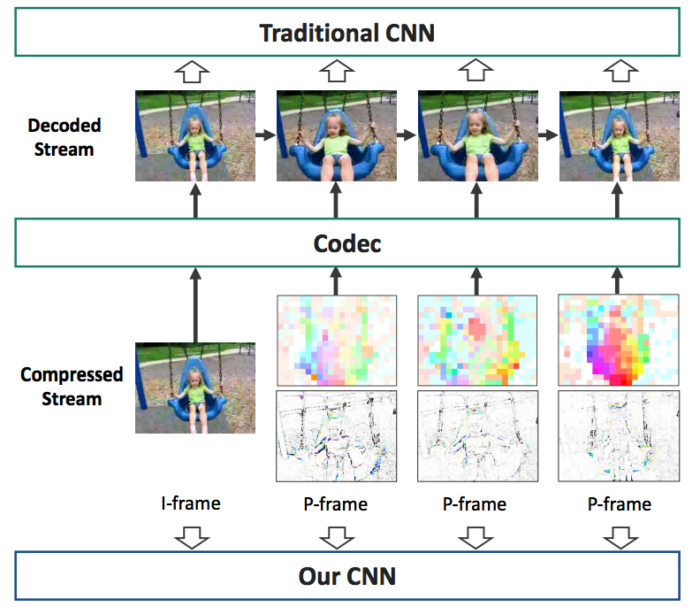

# Compressed Video Action Recognition   
[Chao-Yuan Wu](https://www.cs.utexas.edu/~cywu/), 
[Manzil Zaheer](http://www.manzil.ml/),
[Hexiang Hu](http://hexianghu.com/),
[R. Manmatha](http://ciir.cs.umass.edu/~manmatha/),
[Alexander J. Smola](http://alex.smola.org/),
[Philipp Kr&auml;henb&uuml;hl](http://www.philkr.net/).  
In [CVPR, 2018](https://arxiv.org/abs/1712.00636). 
[[Project Page]](https://www.cs.utexas.edu/~cywu/projects/coviar/)

  

## Overview
This is a reimplementation of CoViAR in [PyTorch](http://pytorch.org/) (the original paper uses [MXNet](https://mxnet.incubator.apache.org/)). This code currently supports [UCF-101](http://crcv.ucf.edu/data/UCF101.php) and [HMDB-51](http://serre-lab.clps.brown.edu/resource/hmdb-a-large-human-motion-database/); [Charades](http://allenai.org/plato/charades/) coming soon. (This is a work in progress. Any suggestions are appreciated.)

## Results
This code produces comparable or better results than the original paper:  
HMDB-51: 52% (I-frame), 40% (motion vector), 43% (residuals), 59.2% (CoViAR).  
UCF-101: 87% (I-frame), 70% (motion vector), 80% (residuals), 90.5% (CoViAR).  
(average of 3 splits; <b>without</b> optical flow. )

## Data loader
<b>We provide a python data loader that directly takes a compressed video and returns the compressed representation (I-frames, motion vectors, and residuals) as a numpy array </b>. 
We can thus train the model without extracting and storing all representations as image files. 

In our experiments, it's fast enough so that it doesn't delay GPU training. 
Please see [`GETTING_STARTED.md`](GETTING_STARTED.md) for details and instructions.

## Using CoViAR

Please see [`GETTING_STARTED.md`](GETTING_STARTED.md) for instructions for training and inference.

## Citation
If you find this model useful for your resesarch, please use the following BibTeX entry.
<pre>
@inproceedings{wu2018coviar,
  title={Compressed Video Action Recognition},
  author={Wu, Chao-Yuan and Zaheer, Manzil and Hu, Hexiang and Manmatha, R and Smola, Alexander J and Kr{\"a}henb{\"u}hl, Philipp},
  booktitle={CVPR},
  year={2018}
}
</pre>

## Acknowledgment
This implementation largely borrows from [tsn-pytorch](https://github.com/yjxiong/tsn-pytorch) by [yjxiong](https://github.com/yjxiong).
Part of the dataloader implementation is modified from [this tutorial](https://blog.csdn.net/leixiaohua1020/article/details/50618190) and FFmpeg [`extract_mv`](https://github.com/FFmpeg/FFmpeg/blob/master/doc/examples/extract_mvs.c) example. 